# Fabb6 Salon Platform - System Flow Diagrams

This document contains comprehensive flow diagrams for all major system processes.

---

## 1. User Authentication Flow

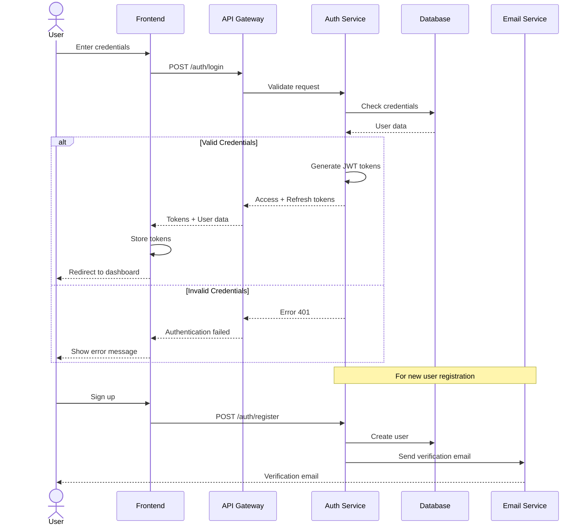

---

## 2. Booking Flow (Client Perspective)

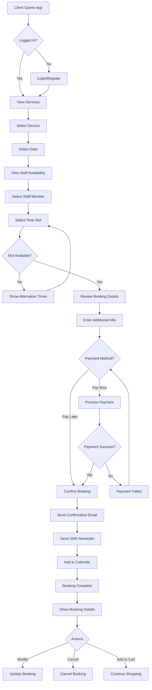

---

## 3. Booking Management Flow (Staff/Admin)

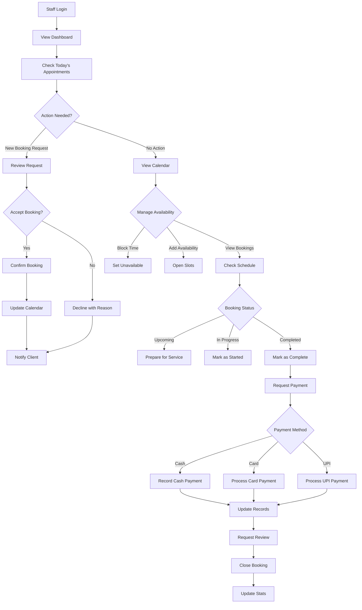

---

## 4. Payment Processing Flow

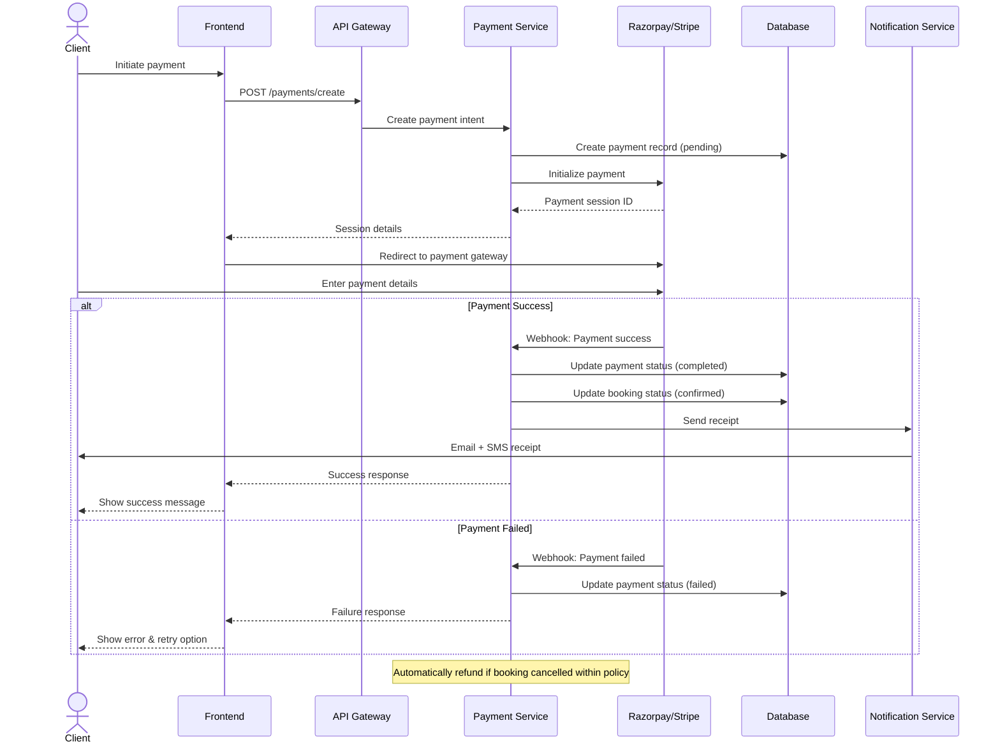

---

## 5. Product Order Flow (E-commerce)

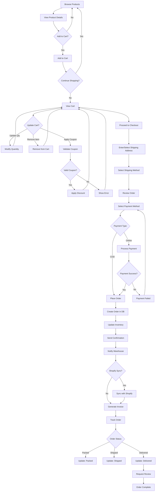

---

## 6. Staff Management Flow

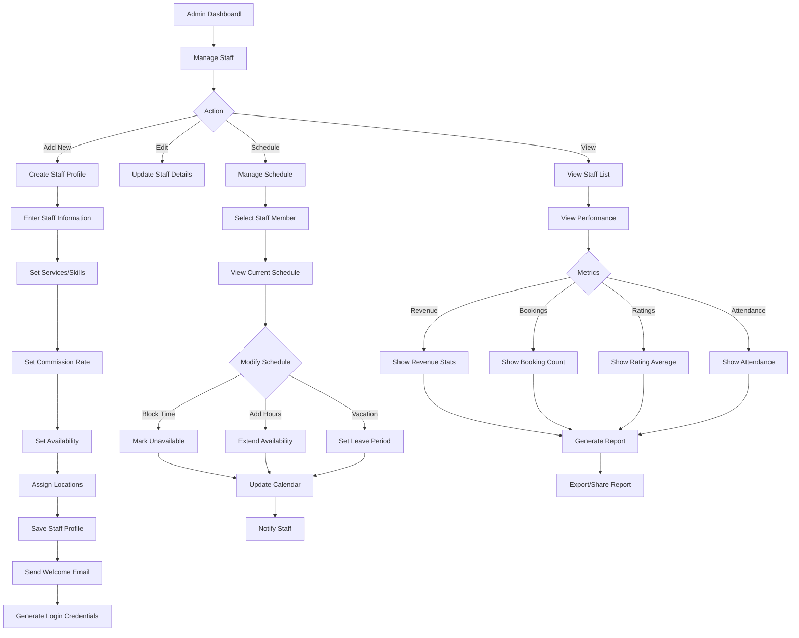

---

## 7. Inventory Management Flow

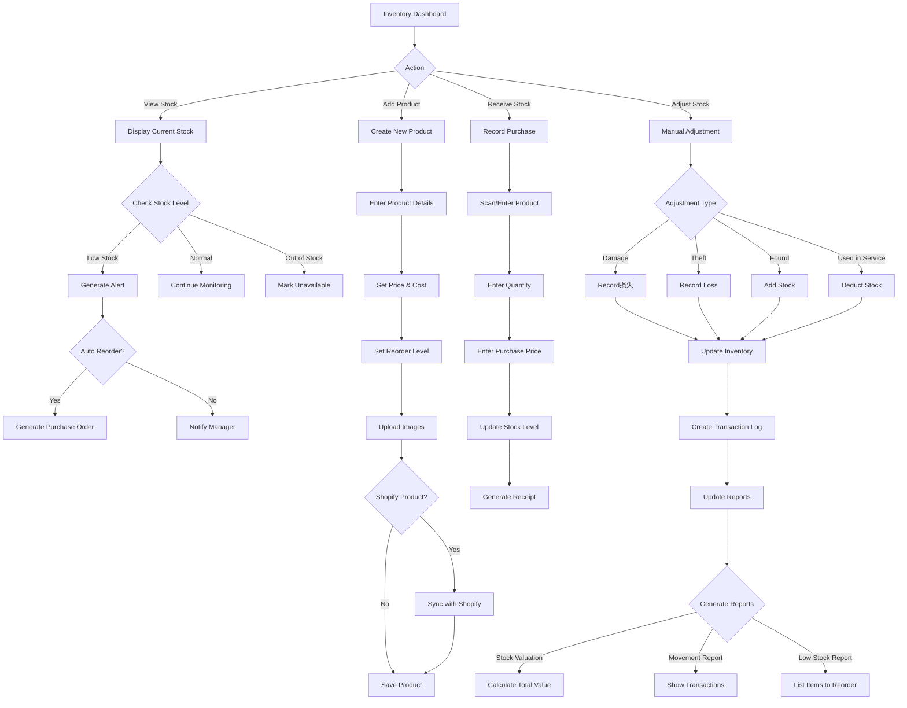

---

## 8. Analytics & Reporting Flow

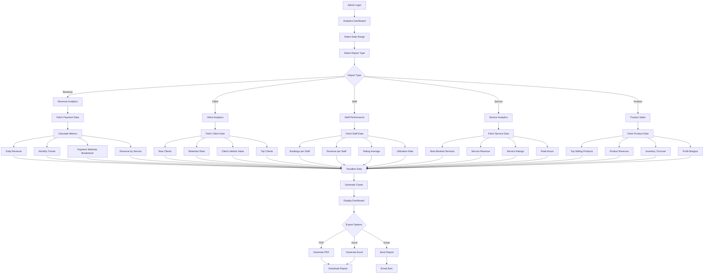

---

## 9. Notification System Flow

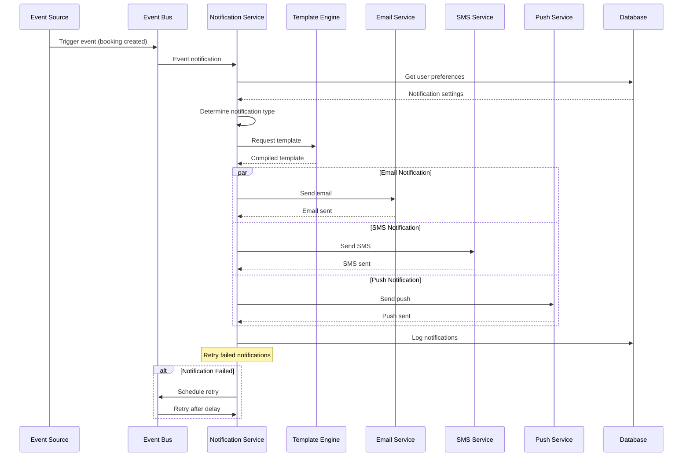

---

## 10. Shopify Integration Flow

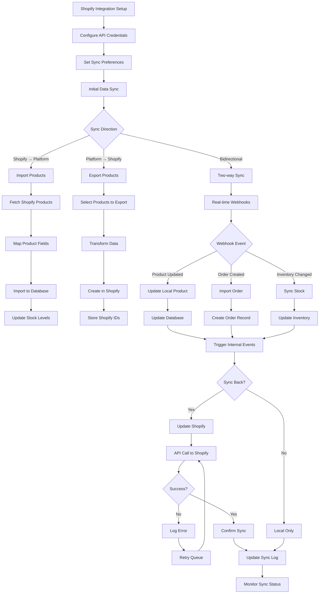

---

## 11. Client Lifecycle Flow

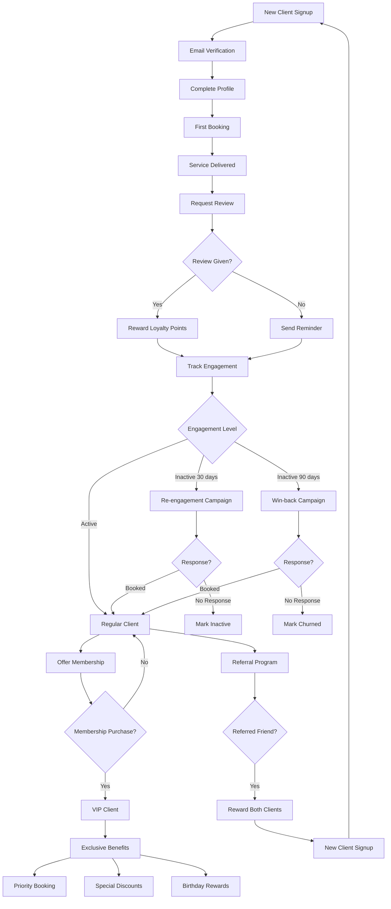

---

## 12. System Architecture - Data Flow

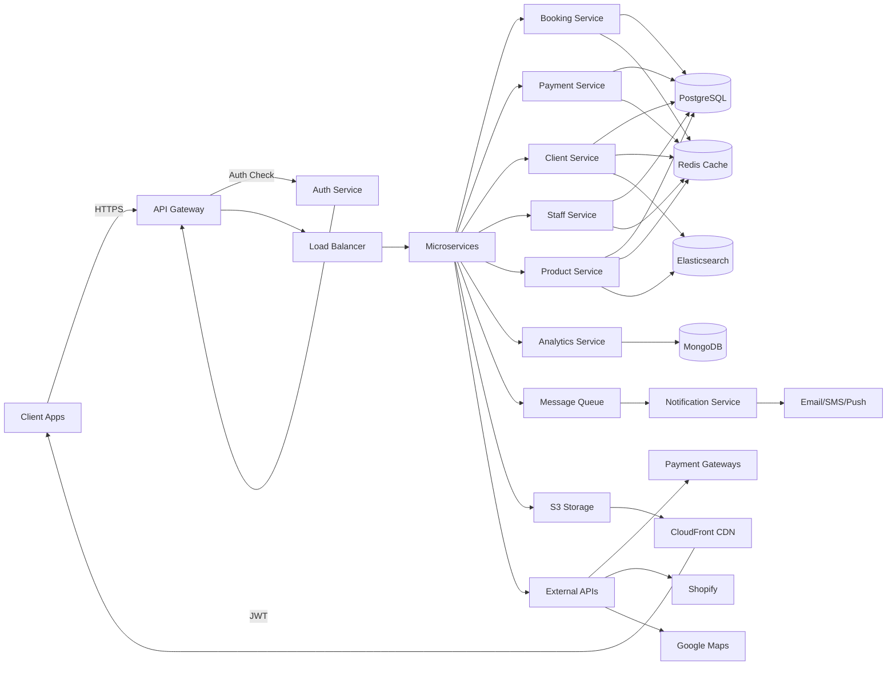

---

## Usage Instructions

These diagrams can be rendered using:
1. **Mermaid Live Editor**: https://mermaid.live/
2. **GitHub**: Automatically renders in markdown
3. **VS Code**: With Mermaid extension
4. **Documentation tools**: GitBook, Docusaurus, etc.

Each diagram represents a critical system flow and can be used for:
- Developer documentation
- Client presentations
- Training materials
- System design discussions
- Debugging and troubleshooting

---

## Additional Diagrams Available On Request

- Multi-location management flow
- Franchise onboarding flow
- White-label deployment flow
- Disaster recovery flow
- Security incident response flow
- API rate limiting flow
- Cache invalidation flow
- Database replication flow
